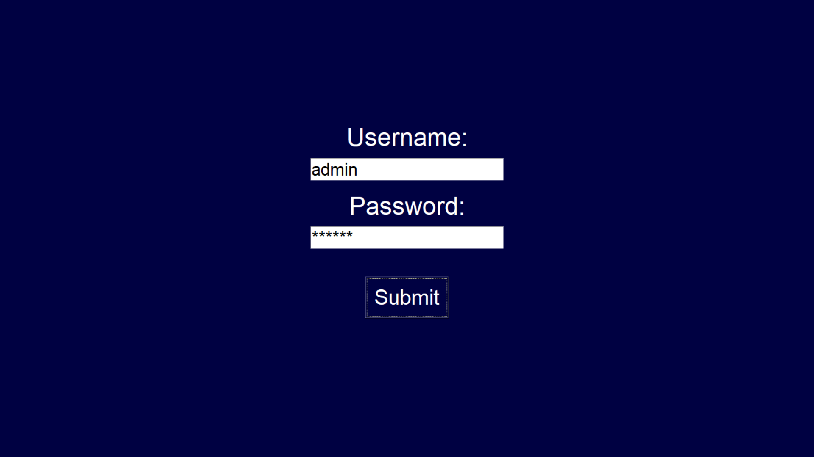
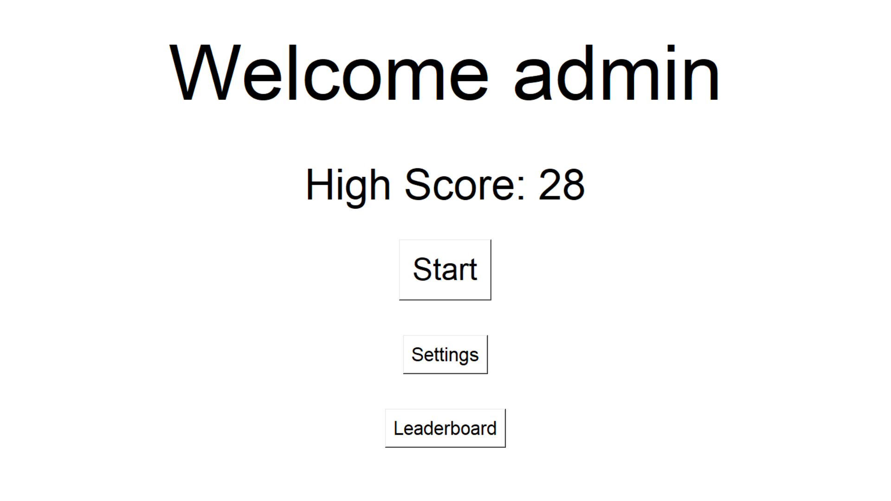
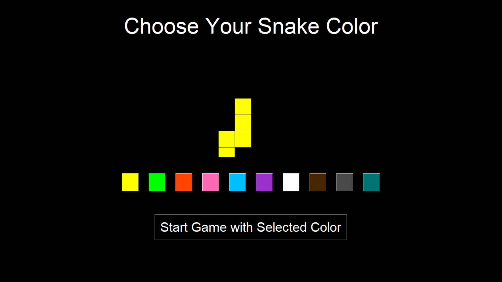

# python-tkinter-snake-game

<div align="center">

# 🐍 Snake Game - Modern Tkinter Edition

A classic Snake game rebuilt with Python & Tkinter, featuring user login, leaderboard, dark/light mode, custom snake colors, background music, and more!

[](https://www.python.org/)
[](https://docs.python.org/3/library/tkinter.html)
[](https://www.pygame.org/)
[](LICENSE)

</div>

## ✨ Features

- Modern UI with **dark/light mode** toggle
- User **login + registration** system (local JSON storage)
- **Leaderboard** showing top 10 high scores
- Choose from **10 beautiful snake color themes**
- Background **music** with on/off toggle
- Progressive **speed increase** as you eat more food
- Wall boundaries around the play area
- Stylish **pause menu** + Game Over screen
- Fullscreen support (**F11** / **Esc** hotkeys)

## 📸 Screenshots

Here are some key screens from the game:

**Login / Registration Screen** 

**Welcome Menu (Light Mode)** 

**Snake Color Selection (Dark Mode)** 

## 🚀 Quick Start

```bash
# 1. Clone the repository
git clone https://github.com/MAINMMTTMAIN/python-tkinter-snake-game
cd python-tkinter-snake-game
# 2. (Optional) Create virtual environment
python -m venv venv
source venv/bin/activate          # Linux / macOS
venv\Scripts\activate             # Windows

# 3. Install dependencies
pip install -r requirements.txt

# 4. Run the game
python main.py
```
## 🎮 How to Play

Arrow keys → Move the snake

P → Pause / Resume

Esc → Open pause menu or exit fullscreen

F11 → Toggle fullscreen

Eat the red food → Grow + Score + Speed up!

## 🛠️ Built With

Python 3.8+

Tkinter (standard GUI library)

Pygame (only for background music)

## 📂 Project Structure

python-tkinter-snake-game/

├── main.py          # Main game file

├── assets/

  │   └── The best Rock in world.mp3

  │   └── snakegame.ico

├── requirements.txt

├── README.md

├── LICENSE

└── .gitignore

## ⚡ Future Improvements (Contributions welcome!)

Different difficulty levels

Online leaderboard (Firebase / Supabase / ...)

More sound effects (eat, collision, etc.)

Score sharing to social media

Mobile version (Kivy?)

## 🤝 Contributing

Pull requests, bug reports, and feature suggestions are very welcome!

## 📄 License

This project is licensed under the MIT License — see the LICENSE file for details.

Made with ❤️ and Python
